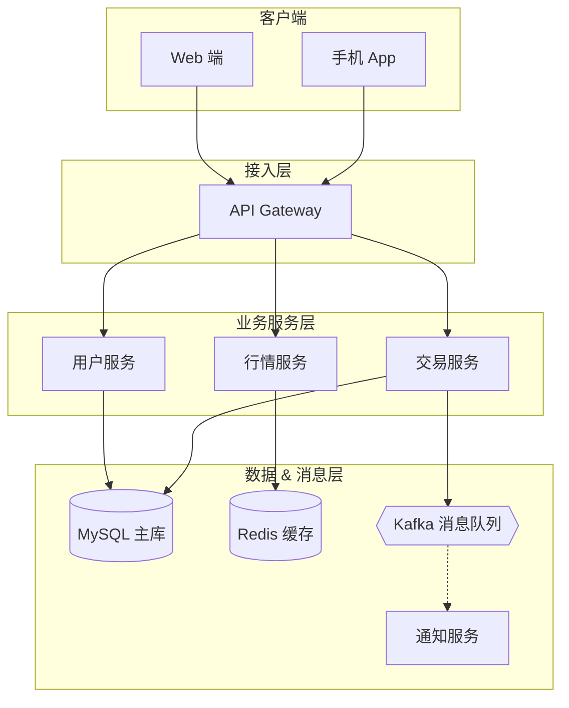

# PM Architecture Diagram Skill

## Use Cases

- New feature system architecture communication
- Microservice architecture overview
- Data flow and system boundary clarification
- Aligning technical approach with engineering teams

## Execution Steps

1. **Parse the user's description** — identify system layers, components within each layer, data flow directions, and external dependencies.

2. **Write Mermaid DSL** to a temp file. Use `flowchart TD` with `subgraph` blocks to represent layers.

   DSL template:
   ```mermaid
   flowchart TD
       subgraph 接入层
           A[App / Web]
           B[API Gateway]
       end
       subgraph 服务层
           C[用户服务]
           D[订单服务]
           E[通知服务]
       end
       subgraph 数据层
           F[(MySQL)]
           G[(Redis)]
           H[(Kafka)]
       end

       A --> B
       B --> C & D
       D --> H
       H --> E
       C --> F & G
       D --> F
   ```

   Node shape guide for architecture:
   - `[Name]` — service or component (rectangle)
   - `[(Name)]` — database (cylinder)
   - `([Name])` — external system (rounded rectangle)
   - `{{Name}}` — queue or message bus (hexagon)

   Use `subgraph LayerName` to group components by tier.
   Data flow arrows: `-->` (solid), `-.->` (dashed for async)

3. **Write DSL to file and render:**
   ```bash
   MMD_FILE="/tmp/architecture_$(date +%Y%m%d_%H%M%S).mmd"
   # Write the Mermaid DSL to $MMD_FILE
   PNG_FILE=$(bash ~/futu-pm-ai-toolkit/scripts/render-mermaid.sh "$MMD_FILE")
   open "$PNG_FILE"
   ```

4. **Report** the PNG file path to the user.

## Example

**Input:** Draw the architecture for a stock trading app: mobile/web clients, API gateway, three backend services (trading, market data, user), a database, and a message queue for notifications

**Mermaid DSL:**

