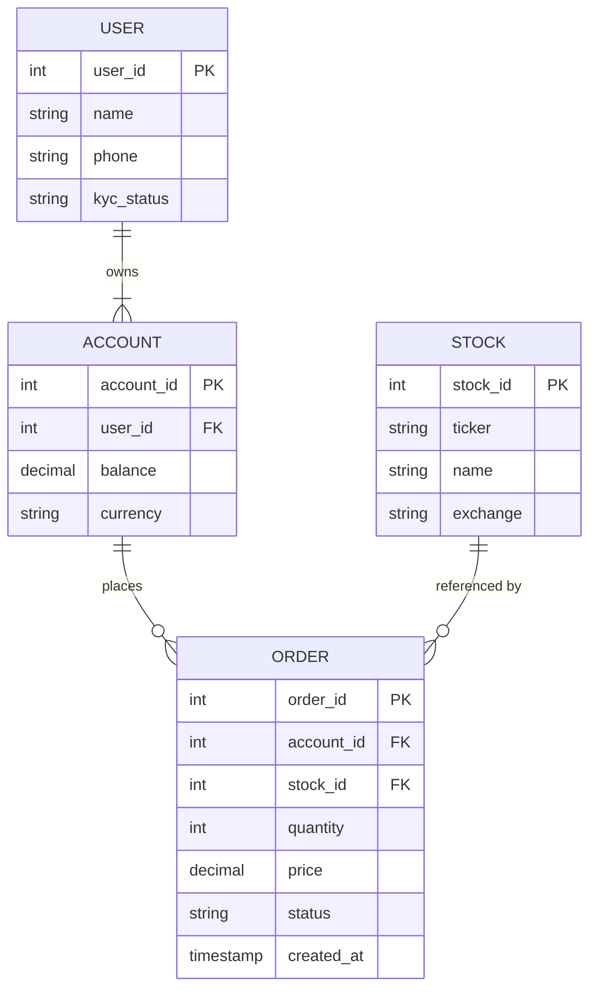

# PM ER Diagram Skill

## Use Cases

- Product data entity relationships
- Database table structure design reviews
- New feature data model communication
- Third-party data integration schema design

## Execution Steps

1. **Parse the user's description** — identify all entities, their key attributes (mark PK/FK), and the relationship type between each pair (one-to-one, one-to-many, many-to-many).

2. **Write Mermaid DSL** to a temp file. Use `erDiagram` syntax.

   DSL template:
   ```mermaid
   erDiagram
       USER {
           int user_id PK
           string username
           string email
       }
       ORDER {
           int order_id PK
           int user_id FK
           decimal amount
           string status
       }
       USER ||--o{ ORDER : "places"
   ```

   Relationship notation:
   - `||--||` — exactly one to exactly one
   - `||--o{` — exactly one to zero or many
   - `}o--o{` — zero or many to zero or many
   - `||--|{` — exactly one to one or many

   Entity attributes: `type name [PK|FK|UK]`

   Entity and attribute names should use English identifiers (database-style). Labels in quotes can be Chinese if needed.

3. **Write DSL to file and render:**
   ```bash
   MMD_FILE="/tmp/er_$(date +%Y%m%d_%H%M%S).mmd"
   # Write the Mermaid DSL to $MMD_FILE
   PNG_FILE=$(bash ~/futu-pm-ai-toolkit/scripts/render-mermaid.sh "$MMD_FILE")
   open "$PNG_FILE"
   ```

4. **Report** the PNG file path to the user.

## Example

**Input:** Draw the ER diagram for a securities trading system: user, account, order, stock

**Mermaid DSL:**

