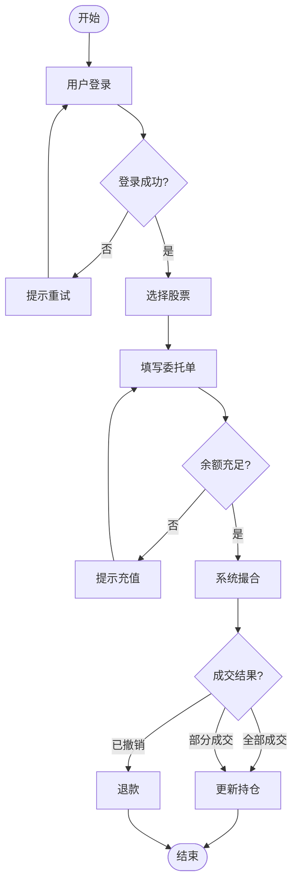

# PM Flowchart Skill

## Use Cases

- User operation flows (registration, login, account opening, purchase)
- Business approval workflows
- System processing logic and branching
- Feature decision trees

## Execution Steps

1. **Parse the user's description** — identify the main flow, all decision branches, error paths, and retry logic.

2. **Write Mermaid DSL** to a temp file. Use `flowchart TD` syntax with Chinese labels in nodes.

   DSL template:
   ```mermaid
   flowchart TD
       A([开始]) --> B[步骤一]
       B --> C{判断条件?}
       C -->|是| D[成功路径]
       C -->|否| E[失败处理]
       E --> B
       D --> F([结束])
   ```

   Node shape guide:
   - `([text])` — start / end (rounded rectangle)
   - `[text]` — process step (rectangle)
   - `{text}` — decision (diamond)
   - `[[text]]` — subprocess

   Node labels may be in Chinese. Wrap labels with special characters in double quotes: `["充值/重试"]`.

3. **Write DSL to file and render:**
   ```bash
   MMD_FILE="/tmp/flowchart_$(date +%Y%m%d_%H%M%S).mmd"
   # Write the Mermaid DSL to $MMD_FILE
   PNG_FILE=$(bash ~/futu-pm-ai-toolkit/scripts/render-mermaid.sh "$MMD_FILE")
   open "$PNG_FILE"
   ```

4. **Report** the PNG file path to the user.

## Example

**Input:** Draw a stock purchase flow: login → select stock → place order → balance check → execution

**Mermaid DSL:**

