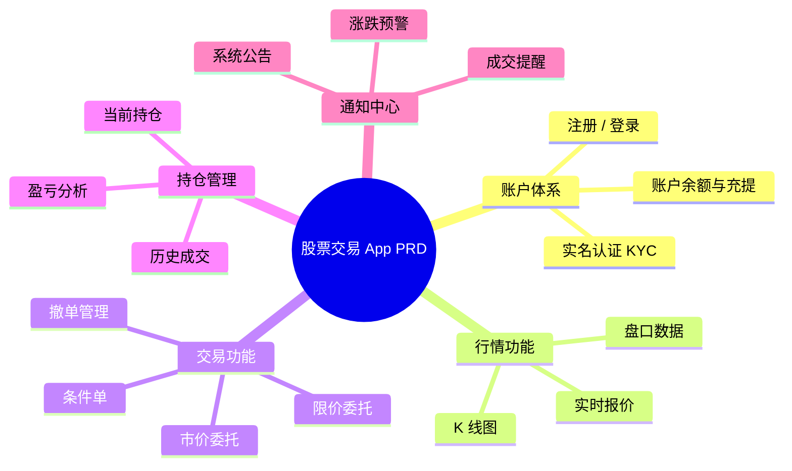

# PM Mind Map Skill

## Use Cases

- PRD feature structure outline
- Requirement discussion brainstorm organization
- Competitive analysis dimension breakdown
- Project scope and boundary discussion

## Execution Steps

1. **Parse the user's description** — identify the central topic and the hierarchy of main branches and sub-nodes (2–3 levels deep is ideal).

2. **Write Mermaid DSL** to a temp file. Use `mindmap` syntax.

   DSL template:
   ```mermaid
   mindmap
     root((中心主题))
       分支一
         子节点 1-1
         子节点 1-2
       分支二
         子节点 2-1
         子节点 2-2
         子节点 2-3
       分支三
         子节点 3-1
   ```

   Syntax rules:
   - Indentation defines hierarchy (2 spaces per level)
   - `root((text))` — circular root node
   - `text` — plain branch or leaf
   - `[text]` — rectangle node
   - `(text)` — rounded node
   - `{{text}}` — hexagon node

   All labels may be in Chinese.

3. **Write DSL to file and render:**
   ```bash
   MMD_FILE="/tmp/mindmap_$(date +%Y%m%d_%H%M%S).mmd"
   # Write the Mermaid DSL to $MMD_FILE
   PNG_FILE=$(bash ~/futu-pm-ai-toolkit/scripts/render-mermaid.sh "$MMD_FILE")
   open "$PNG_FILE"
   ```

4. **Report** the PNG file path to the user.

## Example

**Input:** Mind map for a stock trading app PRD

**Mermaid DSL:**

