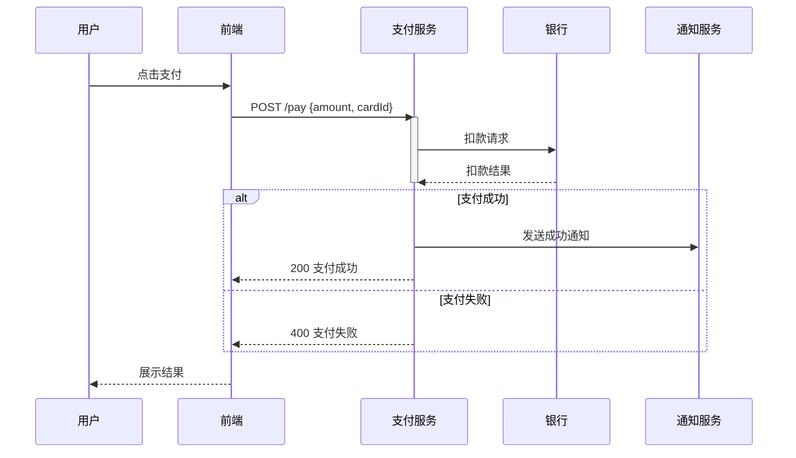

# PM Sequence Diagram Skill

## Use Cases

- Frontend ↔ Backend API interactions
- Microservice call chains
- User ↔ System ↔ Third-party flows
- Payment, authentication, notification critical paths

## Execution Steps

1. **Parse the user's description** — identify all participants and the ordered message flow, including async responses and error conditions.

2. **Write Mermaid DSL** to a temp file. Use `sequenceDiagram` syntax with Chinese labels where needed.

   DSL template:
   ```mermaid
   sequenceDiagram
       participant 用户
       participant 前端
       participant 后端
       participant 数据库

       用户->>前端: 提交表单
       前端->>后端: POST /api/order
       后端->>数据库: 查询余额
       数据库-->>后端: 返回余额
       alt 余额充足
           后端-->>前端: 200 OK
           前端-->>用户: 下单成功
       else 余额不足
           后端-->>前端: 400 余额不足
           前端-->>用户: 提示充值
       end
   ```

   Syntax guide:
   - `participant Name` — declare a participant (optional, improves ordering)
   - `A->>B: message` — solid arrow (synchronous request)
   - `A-->>B: message` — dashed arrow (response)
   - `activate A` / `deactivate A` — show activation bar
   - `alt Condition` / `else` / `end` — conditional block
   - `loop Label` / `end` — loop block
   - `Note over A,B: text` — annotation

3. **Write DSL to file and render:**
   ```bash
   MMD_FILE="/tmp/sequence_$(date +%Y%m%d_%H%M%S).mmd"
   # Write the Mermaid DSL to $MMD_FILE
   PNG_FILE=$(bash ~/futu-pm-ai-toolkit/scripts/render-mermaid.sh "$MMD_FILE")
   open "$PNG_FILE"
   ```

4. **Report** the PNG file path to the user.

## Example

**Input:** Draw a payment sequence: user submits payment → frontend calls payment API → payment service calls bank → bank returns result → notification sent

**Mermaid DSL:**

