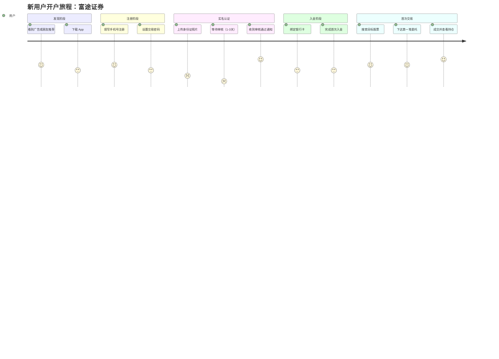

# PM User Journey Skill

## Use Cases

- New user onboarding full-process experience mapping
- Key feature usage path analysis
- Pain point identification and experience optimization
- Multi-role business process mapping

## Execution Steps

1. **Parse the user's description** — identify the user type, journey phases, user tasks per phase, and sentiment score (1–5, where 5 is most positive).

2. **Write Mermaid DSL** to a temp file. Use `journey` syntax.

   DSL template:
   ```mermaid
   journey
       title 用户旅程：[场景名称]
       section 阶段一：[阶段名]
           任务描述 1: 3: 用户
           任务描述 2: 2: 用户, 客服
       section 阶段二：[阶段名]
           任务描述 3: 5: 用户
           任务描述 4: 4: 用户
       section 阶段三：[阶段名]
           任务描述 5: 1: 用户
   ```

   Syntax rules:
   - `title` — overall journey title
   - `section Phase` — a journey phase (column group)
   - `Task description: score: Actor1, Actor2` — one task with sentiment score
   - Score: 1 (very frustrated) → 5 (very happy)
   - Multiple actors separated by comma

   All text may be in Chinese.

3. **Write DSL to file and render:**
   ```bash
   MMD_FILE="/tmp/journey_$(date +%Y%m%d_%H%M%S).mmd"
   # Write the Mermaid DSL to $MMD_FILE
   PNG_FILE=$(bash ~/futu-pm-ai-toolkit/scripts/render-mermaid.sh "$MMD_FILE")
   open "$PNG_FILE"
   ```

4. **Report** the PNG file path to the user.

## Example

**Input:** Draw the user journey for a new user opening a Futu securities account: from awareness to first trade

**Mermaid DSL:**

